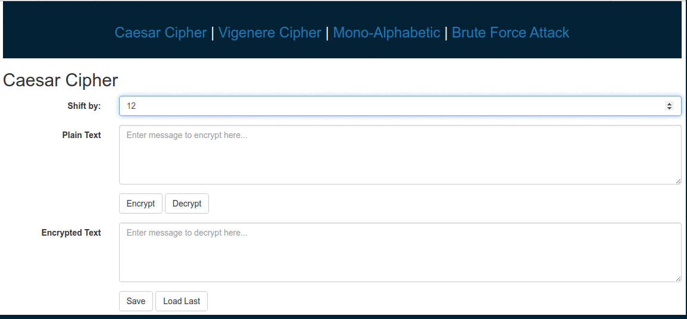

# Web Application for Caesar, Vigenere and Mono-Alphabetic Ciphers

Cipher Text Web Application

#### Requirements
- Python 2.7+
- Flask installed in python
- Flask-SQLAlchemy library
- MYSQL

#### Screen shots of the application
